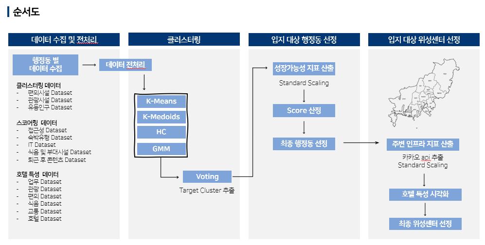

# Busan-Tourism-Organization-Competition

2023 데이터 활용 부산 관광 아이디어 공모전 관련 repository 입니다.
**부산 워케이션 산업생태계 구축 - 위성센터입지선정을 중심으로** 라는 주제를 선정하여 분석을 진행했고 그 결과 금상(1등)을 수상했습니다.

## 서론 : 주제선정배경
- 주제선정배경
워케이션(worcation)은 근로자가 휴가지에서 일상적인 업무를 수행하면서 관광과 휴양을 동시에 실시하는 새로운 관광형태를 의미합니다.
코로나19 이후 원격/재택 근무 보편화로 워케이션이 하나의 트렌드로 부상하였고 2020년을 기점으로 워케이션의 소셜네트워크 버즈량이 전년대비 200%증가하였다는 점에서 이후에도 꾸준히 성장할 것으로 전망됩니다.
실제 워케이션의 수요자인 근로자와 기업을 조사한 결과, 워케이션에 대한 수요가 점차 높아지고 있는 상황임을 확인했습니다.

- 분석방향성
부산시는 지난해 25억 원, 올해 35억 원 등 총 60억 원의 지방 소멸 대응 기금을 투입해 일과 삶, 쉼이 균형 이루는 도시 부산을 만들기 위한 ‘부산형 워케이션’ 활성화 사업을 펼치고 있다는 점을 고려하여
성공적인 부산시 워케이션 생태계 조성을 위해서는 "인구감소지역 외 워케이션 수요자의 만족도를 높이는 지역"에 위성센터를 추가적으로 건설하는 것이 "장기적 워케이션 생태계 구축"에 효과적일 것이라 판단하엿습니다.
따라서 ‘인구감소지역 외 워케이션 위성센터 입지선정’ 분석을 진행했습니다.

## 본론 
프로젝트의 과정은 다음과 같이 6단계로 이루어져 있습니다.
1. 변수설정 & 클러스터링 방법 2.결과비교 3.행정동 선정 4. 스코어링 5. 특성분석 6. 최종입지선정

## 결과
분석 결과 최종 선정 호텔은 "호텔 케니 기장"이며 “호텔 케니 기장”이 다른 호텔에 비해 편의시설 및 교통 환경이 뛰어나다는 점, 그리고 유일하게 호텔 내에 업무 가능 시설과 미팅룸이 존재한다는 점에서 선정하게 되었습니다.
